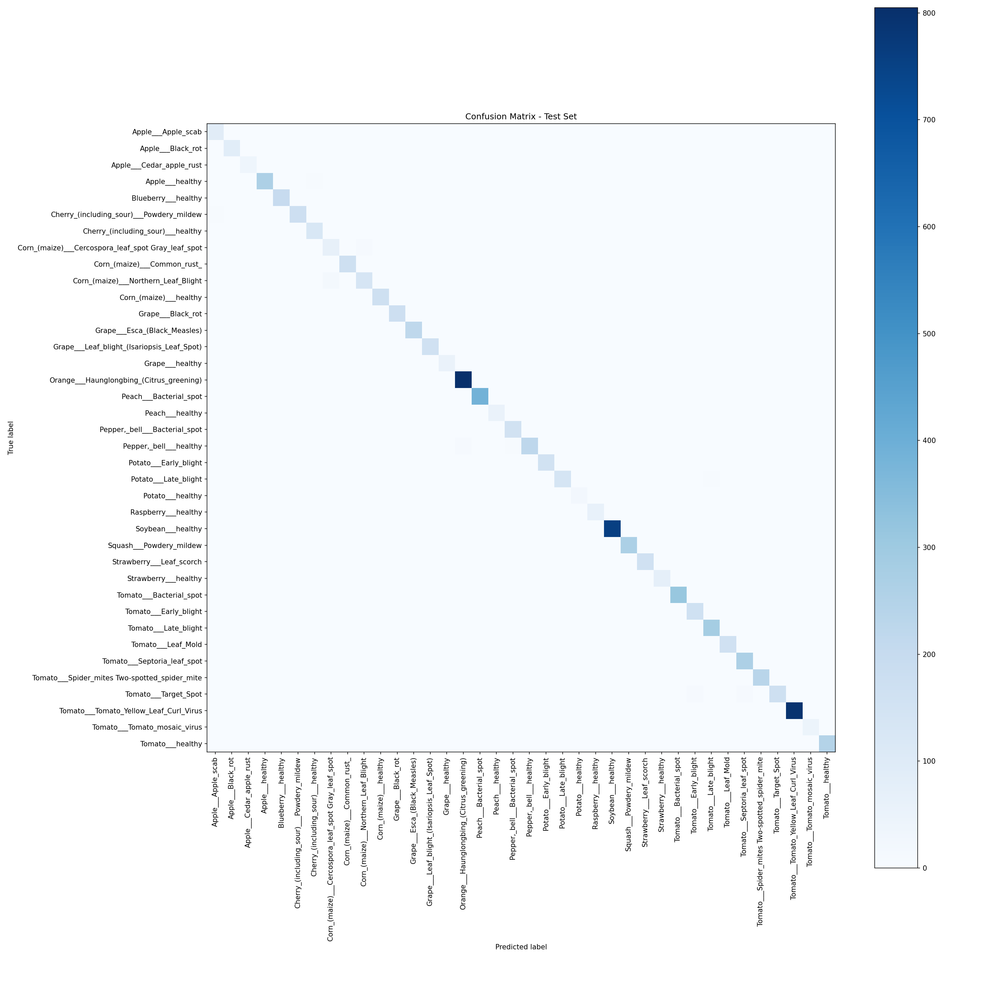
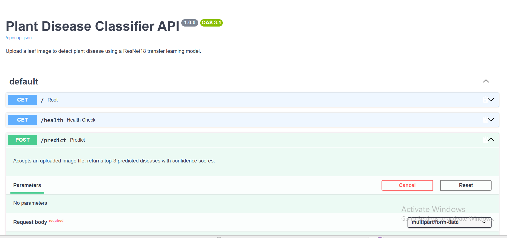
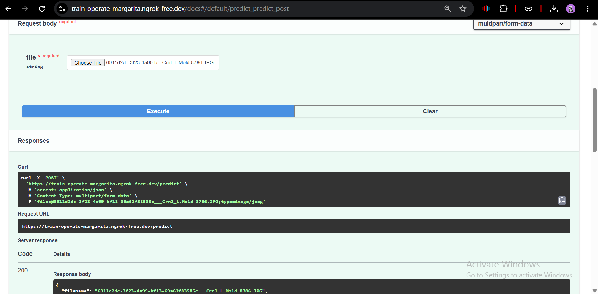
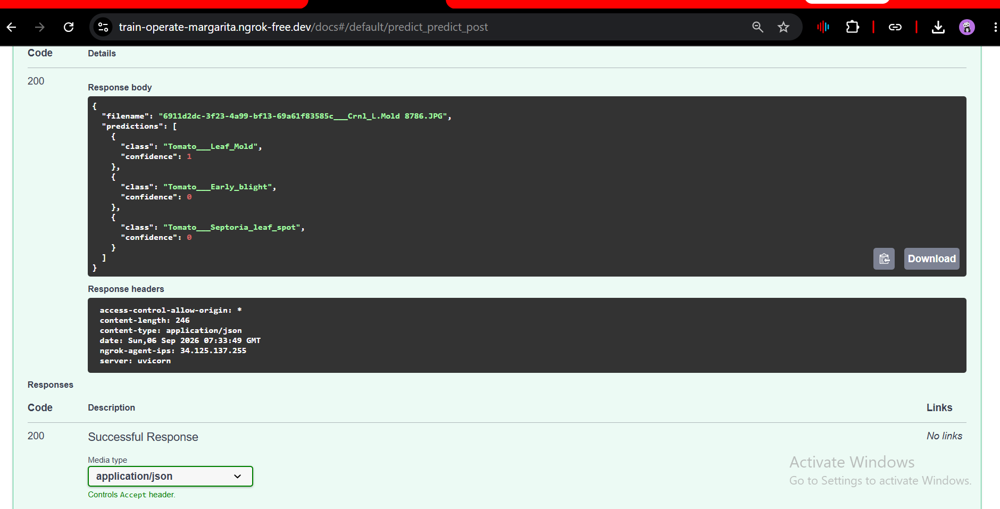

# 🌿 Plant Disease Classifier

A deep learning system that identifies plant diseases from leaf images using transfer learning, achieving **98.45% accuracy** on a held-out test set across 38 disease classes. Deployed as a containerized REST API.



---

## 📌 Problem Statement

Crop diseases cause significant agricultural losses worldwide, and early, accurate diagnosis is often limited by access to plant pathology experts. This project builds an automated image classification system that can identify 38 different plant disease categories (across 14 crop species) directly from a photo of a leaf — a step toward accessible, scalable crop health monitoring.

---

## 🎯 Results

| Metric | Value |
|---|---|
| Test Accuracy | **98.45%** |
| Test F1 (weighted avg) | 0.9845 |
| Test F1 (macro avg) | 0.9778 |
| Classes | 38 |
| Test set size | 8,145 images |

Full per-class precision/recall/F1 breakdown: [`experiments/test_classification_report.txt`](experiments/test_classification_report.txt)

**Notable finding:** The weakest-performing class was `Corn___Cercospora_leaf_spot` (precision 0.83), most likely due to visual similarity with `Corn___Northern_Leaf_Blight` and a comparatively smaller sample size. The confusion matrix above confirms this is the model's primary confusion pair — a good example of where more targeted data collection or class-weighted loss could improve performance further.

**Known limitation:** The model has no "unknown/out-of-distribution" class — since it always outputs a probability distribution over the 38 trained classes, feeding it an image unrelated to plant leaves (e.g. a random photo) will still produce a confident-looking prediction. A production system would need an additional out-of-domain detector or confidence thresholding.

---

## 🏗️ Architecture

- **Base model:** ResNet18, pretrained on ImageNet
- **Transfer learning strategy:** early layers frozen; `layer4` and the final classifier head fine-tuned on plant disease data
- **Classifier head:** `Dropout(0.3) → Linear(512, 38)`
- **Input:** 224×224 RGB images, ImageNet-normalized
- **Training augmentation:** random horizontal flip, rotation (±15°), color jitter — applied to training data only

---

## 📂 Dataset

[PlantVillage Dataset](https://www.kaggle.com/datasets/abdallahalidev/plantvillage-dataset) (color version) — ~54,000 labeled leaf images across 38 classes covering 14 crop species (tomato, apple, corn, grape, potato, and others), each labeled as healthy or with a specific disease.

Split: 70% train / 15% validation / 15% test, using a fixed random seed for reproducibility.

---

## 🗂️ Project Structure

```
plant-disease-classifier/
├── config/
│   └── config.yaml          # All hyperparameters, paths, and settings
├── data/                     # Dataset (not committed - see Setup)
├── src/
│   ├── dataset.py            # Data loading and train/val/test splitting
│   ├── transforms.py         # Image preprocessing and augmentation
│   ├── model.py               # ResNet18 transfer learning architecture
│   ├── train.py               # Training loop with MLflow experiment tracking
│   ├── evaluate.py            # Test set evaluation, classification report, confusion matrix
│   └── predict.py             # Single-image inference
├── app/
│   └── main.py                 # FastAPI serving app (/predict, /health endpoints)
├── tests/
│   ├── test_model.py           # Unit tests for model architecture and freeze logic
│   └── test_dataset.py         # Unit tests for data transforms
├── experiments/                 # Saved evaluation reports and confusion matrix
├── models/
│   └── best_model.pt            # Trained model checkpoint
├── Dockerfile                    # Containerized deployment
└── requirements.txt
```

---

## 🚀 Running Locally

### Option A: Run the API with Docker (recommended)

```bash
git clone https://github.com/ameerhamza18/plant-disease-classifier.git
cd plant-disease-classifier
docker build -t plant-disease-classifier .
docker run -p 8000:8000 plant-disease-classifier
```

Then open `http://localhost:8000/docs` for an interactive API testing interface — upload a leaf image and get predictions with confidence scores.

### Option B: Run directly with Python

```bash
pip install -r requirements.txt
pip install torch torchvision  # CPU or GPU build, as needed
uvicorn app.main:app --host 0.0.0.0 --port 8000
```

### Retraining the model

Training was run on Google Colab (free GPU tier). To reproduce:

```bash
python -m src.train      # trains model, logs to MLflow, saves best checkpoint
python -m src.evaluate   # evaluates on test set, generates report + confusion matrix
```

All hyperparameters (learning rate, batch size, epochs, image size) are controlled from `config/config.yaml` — no code changes needed to experiment with different settings.

---

## 🔌 API Usage Example

**Endpoint:** `POST /predict`

```bash
curl -X POST "http://localhost:8000/predict" \
  -F "file=@sample_leaf.jpg"
```

**Response:**
```json
{
  "filename": "sample_leaf.jpg",
  "predictions": [
    {"class": "Tomato___Late_blight", "confidence": 0.9997},
    {"class": "Potato___Late_blight", "confidence": 0.0003},
    {"class": "Tomato___Early_blight", "confidence": 0.0000}
  ]
}
```

Returning the top-3 predictions with confidence scores (rather than just the single top answer) surfaces model uncertainty honestly, rather than hiding close calls behind a single label.

---

## 📸 Live Demo

**Swagger UI — interactive API testing interface (auto-generated by FastAPI):**



**A real prediction on an uploaded leaf image:**



**Response schema showing structured output with confidence scores:**



---

## 🧪 Testing

```bash
pytest tests/ -v
```

Unit tests cover model output shapes, correct freeze/unfreeze behavior of transfer learning layers, and determinism of evaluation transforms (guarding against accidental data augmentation leaking into evaluation, which would make reported metrics unreliable).

---

## 🛠️ Tech Stack

- **Modeling:** PyTorch, torchvision (ResNet18 transfer learning)
- **Experiment tracking:** MLflow (SQLite backend)
- **Data/metrics:** scikit-learn, pandas, numpy
- **Serving:** FastAPI, Uvicorn
- **Testing:** pytest
- **Deployment:** Docker (CPU-only inference image)
- **Training environment:** Google Colab (GPU)

---

## 📈 Possible Future Improvements

- Add an out-of-distribution detector so the API can flag non-leaf or low-confidence inputs instead of forcing a prediction
- Address the `Corn___Cercospora_leaf_spot` vs `Corn___Northern_Leaf_Blight` confusion with targeted data augmentation or class-weighted loss
- Add CI/CD via GitHub Actions to auto-run tests on every push
- Deploy to a persistent cloud host (Render/HuggingFace Spaces) instead of local Docker only
- Build a lightweight frontend so non-technical users can test the model without using the Swagger UI

---

## 👤 Author

**Ameer Hamza**  
[LinkedIn](www.linkedin.com/in/ameer-hamza-8990953bb) • [GitHub](https://github.com/ameerhamza18) 
